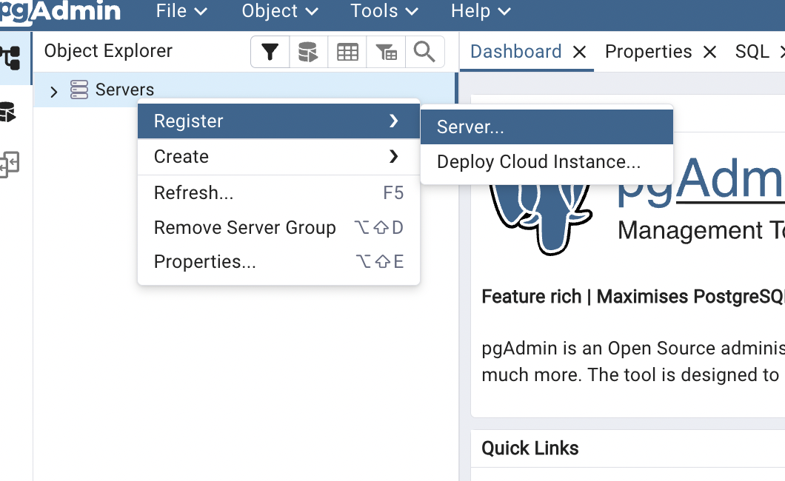
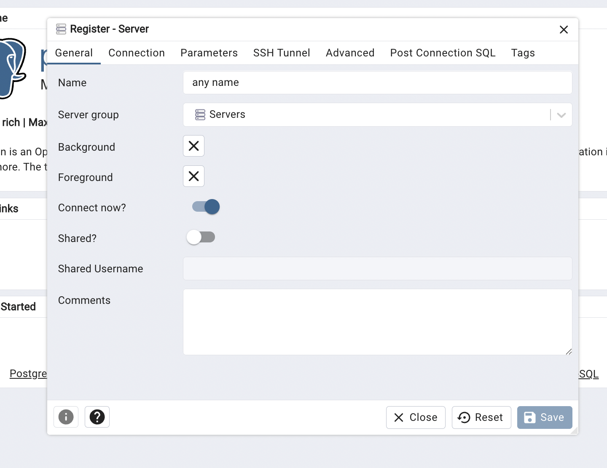
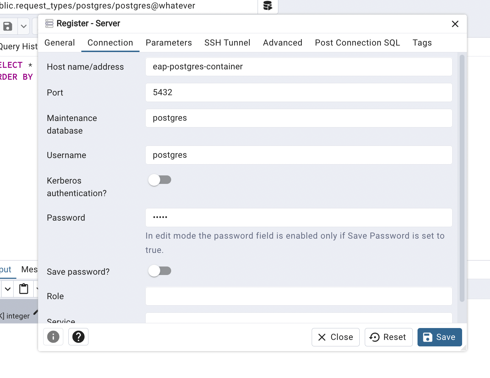

# React, FastAPI and Postgres in Containers with Nginx Forwarding to Vite Dev Server

React, fastapi and postgres all in containers, with Nginx forwarding requests to both Uvicorn (for FastAPI) and React.
Nginx is still not serving the React part itself in this deployment, it only forwards the requests to React's dev
server (vite).

---

## Setup overview:

### Entities:

- Containers:
    - Container for Postgres (official image)
    - Container for FastAPI running FastAPI's default dev server
    - Container for React running a dev server (vite)
    - *Optional* - PgAdmin container


- Nginx - running directly on the machine

### Communications:

- Browser ⇆ React:
    - Browser → Nginx (via localhost)
    - Nginx → Vite in React container (via localhost and Docker port mapping)
    - Vite → React

- Browser ⇆ FastAPI:
    - Browser → Nginx (via localhost)
    - Nginx → Uvicorn in FastAPI container (via localhost and Docker port mapping)
    - Uvicorn → FastAPI

- FastAPI container ⇆ Postgres containers (via a docker network)
- PgAdmin container ⇆ Postgres container (via a docker network)

---

## Steps

### 1. Docker network

Create a Docker network (Make sure the name is not taken):

```bash
docker network create eap-docker-net
```

---

### 2. Postgres

Run a container off the official Postgres image with the network you just created in the previous step.  
The default Postgres port of 5432 might already be used by Postgres on our PC, so we'll map the container's 5432 to 5431
instead:

```bash
docker run --name eap-postgres-container \
  --network eap-docker-net \
  -e POSTGRES_PASSWORD=12345 \
  -p 5431:5432 \
  -d postgres
```

---

### 3. Fastapi

#### 3.1 Configure environment variables

Create a `.env` file if it doesn't exist. example:

- DATABASE_TYPE=postgresql
- DATABASE_HOST=eap-postgres-container # (Docker containers can communicate by using each other's names if they both run
  on the same Docker network)
- DATABASE_PORT=5432 # (We're already using the container as the host in the line above, so this is the container's
  port, which is still the default of 5432)
- DATABASE_USER=postgres
- DATABASE_PASSWORD=12345 # same password as used in the command for running the container
- DATABASE_NAME=postgres # (can be any value)
- JWT_SECRET_KEY="my secret key" # (can be any value)

DEVELOPMENT_ENVIRONMENT=True

APP_ENV=development
LOG_LEVEL=debug

# Email

EMAIL_SERVICE='mailjet' # 'mailtrap' or 'mailjet'

# Sender

MAIL_FROM_EMAIL='motopp.it31@gmail.com'
MAIL_FROM_NAME='Motopp'

# Mailtrap

MAILTRAP_USER='8e9b8c8308abbc'
MAILTRAP_SMTP_PASSWORD='f9b7ff5fcd3b8e'
MAILTRAP_SMTP_HOST='sandbox.smtp.mailtrap.io'
MAILTRAP_SMTP_PORT=2525
MAILTRAP_USE_TLS=True

# Mailjet

MAILJET_API_KEY='a33ca8680186a619b9c4f9851edb30bb'
MAILJET_SECRET_KEY='87c0c3b366ee5ff1cadf1883dd331dc6'
---

#### 3.2 Configure CORS in FastAPI

For allowing the frontend in CORS, make sure localhost:8080. is in the allowed CORS origins. This works for both running
Vite in a container and running Vite directly on the machine.

```python
CORS_ALLOWED_ORIGINS: list[str] = [
    "http://localhost:8080",
]
```

Note: We do NOT set it http://localhost:8080/api , this is explained further in step 5.2.

Second, for CORS itself
For getting the initial webpage from Vite, the browser sends a request to localhost:8080, which is received by Nginx and
forwards it to localhost:5173.
Since the machine's port 5173 will be mapped to the container's 5173, the request will reach the container. But the
browser is not aware that this is what happens behind the
scenes, and so, it also doesn't know that the response came from a container. As far as it's concerned, it got the
frontend from the machine's localhost:5173 and this is the page's origin. Result: Any subsequent API request (the ones
to the backend container)
from this JS will have the origin http://localhost:5173.

---

#### 3.3 Create the .dockerfile:

```dockerfile
FROM python:3.13-slim

WORKDIR /app

COPY requirements.txt .

RUN pip install -r requirements.txt

COPY . .

EXPOSE 8000

CMD sh -c "alembic upgrade head && python3 scripts/seed/run.py && uvicorn app.main:app --host 0.0.0.0 --port 8000"
```

---

#### 3.4 Build the FastAPI image:

```bash
docker build --no-cache -t eap-backend-image .
```

#### 3.5 Run a container:

```bash
docker run --name eap-backend-container \
  --network eap-docker-net \
  -it \
  -p 8000:8000 \
  eap-backend-image
```

---

### 4. pgAdmin

#### 4.1 Run a pgAdmin container (Regular pgAdmin can also be used, but it seems to be very slow)

```bash  
docker run --name eap-pgadmin-container \
  --network eap-docker-net \
  -p 5050:80 \
  -e PGADMIN_DEFAULT_EMAIL=admin@example.com \
  -e PGADMIN_DEFAULT_PASSWORD=admin \
  -d dpage/pgadmin4
```

---

#### 4.2 Go to localhost:5050 in the browser and log in with the email and password you ran the container with.

#### 4.3 Connect to the postgres container we ran (register server):





Go to the connection tab. Use the name of the postgres container as the host (Docker containers can communicate by using
each other's names if they both run on the same Docker network). Since we're using the container name, we are
referencing
the Postgres container directly so the port needs to be the port here postgres runs inside the container (5432). If you
ran regular pgAdmin (not in a container), then pgadmin will have to connect to the postgres container via the host with
the port mapping we defined, and then the host name would be localhost and the port 5431.

Also fill in the correct username and password, the ones you gave the postgres container.



### 5. React

#### 5.1 Change Vite to run on 0.0.0.0 instead of on localhost

In the "dev" script in package.JSON, add the --host flag to the vite command:

```bash
"vite --host"
```

This way, later when Vite will run inside a container, it'll make vite listen not only to the container's localhost, but
to all interfaces (0.0.0.0). Thus, Vite will listen to messages coming from the host.

---

#### 5.2 Make sure that Vite has the correct IP and port of the backend

Later, in step 6, we'll configure Nginx to run on localhost and listen to port 8080 for serving both the React part and
the FastAPI part. So in our React code, we'll set the API's URL (the URL of all the requests the browser makes to
FastAPI) to localhost 8080.

```bash
VITE_API_URL=http://127.0.0.1:8080/
```

Together with the prefix that's defined in the backend (```API_V1_PREFIX = "/api/v1"```), all
the requests that the browser will make with the webpage's JS code, will start with http://127.0.0.1:8080/api/v1/ and be
forwarded by Nginx to FastAPI.

For example: http://127.0.0.1:8080/api/v1/auth/login

NOTE:
Back in step 3.2, we added localhost:8080 to CORS and not 127.0.0.1:8080/api/v1/. This is how it needs to be because
CORS only cares about the Origin. The Origin is defined strictly as:
Protocol + Domain + Port

When a user visits our site at http://127.0.0.1:8080, the browser stamps every single request coming from that page
with the header:
Origin: http://127.0.0.1:8080
It does not include the path (/api/) in the Origin. Even if the JavaScript is sending a request
to http://127.0.0.1:8080/api/users, the "home base" (Origin) is still just http://127.0.0.1:8080.
---

#### 5.3 Create the .Dockerfile:

```dockerfile
FROM node

WORKDIR /app

COPY package.json .

RUN npm install

COPY . .

EXPOSE 5173

CMD ["npm", "run", "dev"]
```

---

### 5.4 Build the image

```bash
docker build --no-cache -t eap-frontend-image .
```

---

### 5.5 Run a container

```bash
docker run -p 5173:5173 --name eap-frontend-container eap-frontend-image
```

Explanation:

- Inside the container, Vite will run on its default port of 5173.
- In step 5.1 we already set Vite to listen to all network interfaces and not just the container's localhost.
- That took care of the IP level, but we will also need the correct port. The browser will send messages to Nginx on
  localhost:8080, which will forward it to localhost:5173, and since we mapped the ports, Docker will forward it to the
  container's eth0 (the container's virtual Ethernet interface) on port 5173. Since Vite is listening to all interfaces (0.0.0.0) on port 5173, the request will reach it.

---

## 6. Nginx (The instructions are written for Mac!)

### 6.1 Install Nginx

```bash
brew install nginx
```

### 6.2 Confirm successful installation

```bash
nginx -v
```

### 6.3 Clear the config file

Path:

```
/opt/homebrew/etc/nginx/nginx.conf
```

Enter this content instead:

```nginx
worker_processes 1;

events {
    worker_connections 1024;
}

http {
    include mime.types;

    # --- THE FRONTEND CONNECTION ---
    # Since Nginx is NOT in a container, it looks at "127.0.0.1" (your laptop).
    # This ONLY works if your containers have port mapping:
    # e.g., 'docker run -p 5173:5173 ...'
    #
    # Note: We are consistently using 127.0.0.1 for clarity.
    # We could just as well have used "localhost" everywhere,
    # since both resolve to the same loopback interface.
    upstream vite_cluster {
        server 127.0.0.1:5173;
    }

    # --- THE BACKEND CONNECTION ---
    # Similar to Vite, we point to the port mapped on your host machine (8000).
    upstream fastapi_cluster {
        server 127.0.0.1:8000;
    }

    server {
        # This listens on port 8080.
        # In a real-world scenario, you'd change this to 80 (standard HTTP).
        listen 8080;

        # We use 127.0.0.1 for consistency with the upstream definition.
        # Using "localhost" here would work exactly the same.
        server_name 127.0.0.1;

        # So the above works for requests that asked for 127.0.0.1:8080

        # This block handles the React app
        location / {
            proxy_pass http://vite_cluster; # redirecting the received requests to the cluster we defined above. So still 127.0.0.1, but a different port.
            proxy_set_header Host $host;
            proxy_set_header X-Real-IP $remote_addr;
            proxy_set_header X-Forwarded-For $proxy_add_x_forwarded_for;
        }

        # This block handles the API requests
        location /api {
            proxy_pass http://fastapi_cluster;
            proxy_set_header Host $host;
            proxy_set_header X-Real-IP $remote_addr;
            proxy_set_header X-Forwarded-For $proxy_add_x_forwarded_for;
            
            # OPTIONAL: If your FastAPI routes do NOT start with /api 
            # (e.g., your code is @app.get("/users") instead of @app.get("/api/users")),
            # uncomment the line below to strip "/api" before sending it to FastAPI:
            # rewrite ^/api/(.*)$ /$1 break;
        }
    }
}
```

---

### 6.4 Start Nginx

```bash
nginx
```

### 6.5 Go to:

```
http://127.0.0.1:8080
```

to see if the application can be reached.

---

## Sources

These instructions were based on, yet don't follow exactly, the following tutorials:

- https://www.youtube.com/watch?v=q8OleYuqntY
- https://www.youtube.com/watch?v=Hs9Fh1fr5s8&t=299s&pp=ygUPcG9zdGdyZXMgZG9ja2Vy