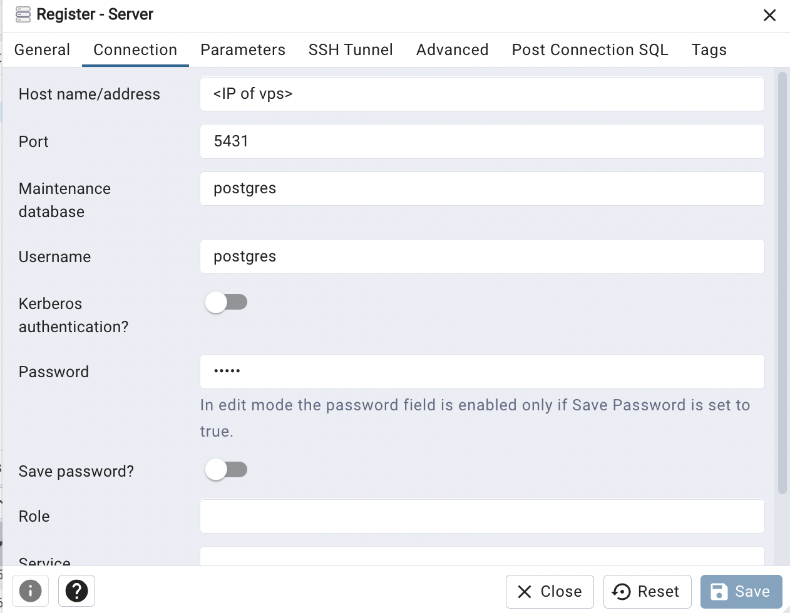

# Fastapi, postgres and Nginx+React all in containers

Fastapi, postgres and Nginx+React all in containers, with Nginx forwarding backend requests to Uvicorn (for FastAPI) and
serving React's static files. Vite is no longer used for its dev server, only for building the bundle (dist folder).

---

## Setup overview:

### Entities:

- Containers:
    - Container for Postgres (official image)
    - Container for FastAPI running FastAPI's default dev server
    - Container for Nginx serving the static files of React
    - *Optional* - PgAdmin container

### Communications:

- Browser ⇆ React:
    - Browser → Nginx (via localhost)
    - Nginx serves React's static files

- Browser ⇆ FastAPI:
    - Browser → Nginx in a container (via localhost)
    - Nginx in a container → Uvicorn in FastAPI container (via a docker network)~~
    - Uvicorn → FastAPI

- FastAPI container ⇆ Postgres containers (via a docker network)
- PgAdmin container ⇆ Postgres container (via a docker network)~~

---

## Steps

### 1. Docker network

Create a Docker network (Make sure the name is not taken):

```bash
docker network create eap-docker-net
```

---

### 2. Postgres

Run a container off the official Postgres image with the network you just created in the previous step.  
No need for port mapping since both FastAPI and pgAdmin will communicate with it using the docker network we created -
eap-docker-net. We'll create a volume too to avoid data loss.

```bash
docker run --name eap-postgres-container --network eap-docker-net -v pgdata:/var/lib/postgresql -e POSTGRES_PASSWORD=12345 -p 5431:5432 -d postgres
```

---

### 3. Fastapi

#### 3.1 Configure environment variables

Create a `.env` file if it doesn't exist:

```bash
- DATABASE_TYPE=postgresql
- DATABASE_HOST=eap-postgres-container # (Docker containers can communicate by using each other's names if they both run
  on the same Docker network)
- DATABASE_PORT=5432 # (We're already using the container as the host in the line above, so this is the container's
  port, which is still the default of 5432)
- DATABASE_USER=postgres
- DATABASE_PASSWORD=12345 # same password as used in the command for running the container
- DATABASE_NAME=postgres # (can be any value)
- JWT_SECRET_KEY="my secret key" # (can be any value)

DEVELOPMENT_ENVIRONMENT=True

APP_ENV=development
LOG_LEVEL=debug

# Email

EMAIL_SERVICE='mailjet' # 'mailtrap' or 'mailjet'

# Sender

MAIL_FROM_EMAIL='motopp.it31@gmail.com'
MAIL_FROM_NAME='Motopp'

# Mailtrap

MAILTRAP_USER='8e9b8c8308abbc'
MAILTRAP_SMTP_PASSWORD='f9b7ff5fcd3b8e'
MAILTRAP_SMTP_HOST='sandbox.smtp.mailtrap.io'
MAILTRAP_SMTP_PORT=2525
MAILTRAP_USE_TLS=True

# Mailjet

MAILJET_API_KEY='a33ca8680186a619b9c4f9851edb30bb'
MAILJET_SECRET_KEY='87c0c3b366ee5ff1cadf1883dd331dc6'
---

#### 3.2 Configure CORS in FastAPI

No need to allow any IP in CORS, CORS_ALLOWED_ORIGINS can stay empty.

```python
CORS_ALLOWED_ORIGINS: list[str] = [
]
```

CORS can stay empty. To-Do: Add explanation why.

---

#### 3.3 Create the .dockerfile:

```dockerfile
FROM python:3.13-slim

WORKDIR /app

COPY requirements.txt .

RUN pip install -r requirements.txt

COPY . .

EXPOSE 8000

CMD sh -c "alembic upgrade head && python3 scripts/seed/run.py && uvicorn app.main:app --host 0.0.0.0 --port 8000"
```

---

#### 3.4 Build the FastAPI image:

```bash
docker build --no-cache -t eap-backend-image .
```

#### 3.5 Run a container:

Remember to remove the interactive flag later!

```bash
docker run --name eap-backend-container --network eap-docker-net -it eap-backend-image
```

---

### 4. pgAdmin

#### 4.1 Run a pgAdmin container (Regular pgAdmin can also be used, but it seems to be very slow)

```bash  
docker run --name eap-pgadmin-container \
  --network eap-docker-net \
  -p 5050:80 \
  -e PGADMIN_DEFAULT_EMAIL=admin@example.com \
  -e PGADMIN_DEFAULT_PASSWORD=admin \
  -d dpage/pgadmin4
```

---

#### 4.2 Go to localhost:5050 in the browser and log in with the email and password you ran the container with.

#### 4.3 Connect to the postgres container we ran (register server):


Go to the connection tab. Use the IP of the VPS as the host. For the port we'll use the VPS's port that we mapped to the
Postgres container's port. Also fill in the correct username and password, the ones you gave the postgres container.



### 5. React


#### 5.2 Make sure that Vite has the correct IP and port of the backend

Later, in step 6, we'll configure the containerized Nginx to run on localhost and listen to port 80 for serving both the
built React files and
the FastAPI part. We'll map the machine's port 80 to the container's 80, so in our React code, we'll set the API's
URL (the URL of all the requests the browser makes to
FastAPI) to 37.97.253.83 (port 80 is already the default).

```bash
VITE_API_URL=http://37.97.253.83/
```

Together with the prefix that's defined in the backend (```API_V1_PREFIX = "/api/v1"```), all
the requests that the browser will make with the webpage's JS code, will start with http://37.97.253.83/api/v1/ and be
forwarded by Nginx to FastAPI.

For example: http://37.97.253.83/api/v1/auth/login

---

#### 5.3 Create the .Dockerfile:

```dockerfile
# --- STAGE 1: Build (The "Builder" stage) ---
FROM node:20-alpine AS builder

WORKDIR /app

# 1. Install dependencies first
# (This is a Docker trick: if your package.json hasn't changed,
# Docker will skip this slow step on the next build)
COPY package*.json ./
RUN npm install

# 2. Copy your source code into the container
COPY . .

# 3. Build the static files
# This runs "tsc -b && vite build" from your package.json
RUN npm run build

# --- STAGE 2: Serve (The "Final" stage) ---
FROM nginx:stable-alpine

# 4. Copy the static 'dist' folder from the builder stage
# to Nginx's default public folder
COPY --from=builder /app/dist /usr/share/nginx/html

# 5. Copy your custom Nginx config to the correct location
# inside the container to handle the /api proxying
COPY nginx.conf /etc/nginx/conf.d/default.conf

# 6. Nginx inside the container listens on port 80 by default.
# We will map this to 8080 on your Mac when we 'docker run'.
EXPOSE 80

# 7. Start Nginx in the foreground so the container stays alive
CMD ["nginx", "-g", "daemon off;"]
```
### 5.4

Create nginx.conf content in the frontend repo:

```nginx
server {

    listen 80;

    # In Docker, "localhost" refers to the container itself.
    server_name localhost;

    # --- THE FRONTEND CONNECTION (Static Files) ---
    # Instead of proxying to a Vite cluster (127.0.0.1:5173),
    # Nginx now serves the pre-built static files directly from its own disk.
    location / {
        # This is where our Dockerfile copied the 'dist' folder.
        root /usr/share/nginx/html;
        index index.html;

        # CRITICAL FOR REACT ROUTER:
        # Single Page Apps (SPAs) manage routing in the browser.
        # If a user refreshes 'http://37.97.253.83/dashboard', Nginx won't find
        # a 'dashboard' folder. This line tells Nginx: "If the file doesn't
        # exist, send them index.html and let React handles the rest."
        try_files $uri $uri/ /index.html;
    }

    # --- THE BACKEND CONNECTION (Reverse Proxy) ---
    # This handles any browser requests starting with /api (e.g., /api/v1/login).
    location /api {
        # Because Nginx and FastAPI are in separate containers on the same
        # Docker network, we can use the backend's CONTAINER NAME as the address.
        proxy_pass http://eap-backend-container:8000;

        # Standard headers to ensure the Backend knows the real user's info
        proxy_set_header Host $host;
        proxy_set_header X-Real-IP $remote_addr;
        proxy_set_header X-Forwarded-For $proxy_add_x_forwarded_for;
        proxy_set_header X-Forwarded-Proto $scheme;


    }
}
```
---

### 5.4 Build the image

```bash
docker build --no-cache -t eap-frontend-image -f production.Dockerfile .
```

---

### 5.5 Run a container

```bash
docker run --name eap-frontend-container \
  --network eap-docker-net \
  -p 80:80 \
  -d eap-frontend-image
```

Explanation:

- Inside the container, Nginx will run on its default port of 80.
  The browser will send messages to http://37.97.253.83:80, and since we mapped the ports, Docker will forward it to the
  container's eth0 (the container's virtual Ethernet interface) on port 80.

---


### 6.5 Go to your IP in the browser and see if the application can be reached.

---

## Sources

These instructions were based on, yet don't follow exactly, the following tutorials:

- https://www.youtube.com/watch?v=q8OleYuqntY
- https://www.youtube.com/watch?v=Hs9Fh1fr5s8&t=299s&pp=ygUPcG9zdGdyZXMgZG9ja2Vy