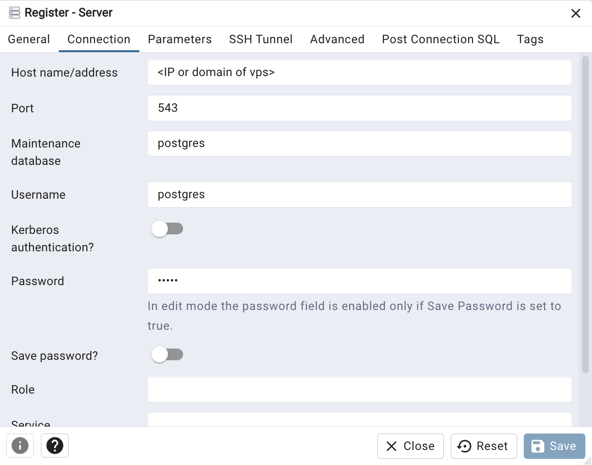

# Fastapi, postgres and Nginx+React all in containers

Fastapi, postgres and Nginx+React all in containers, with Nginx forwarding backend requests to Uvicorn (for FastAPI) and
serving React's static files. Vite is no longer used for its dev server, only for building the bundle (dist folder).

---

## Setup overview:

### Entities:

- Containers:
    - Container for Postgres (official image)
    - Container for FastAPI running FastAPI's default dev server
    - Container for Nginx serving the static files of React
    - *Optional* - PgAdmin container (deployed on client machine)

### Communications:

- Browser ⇆ React:
    - Browser → Nginx (via localhost)
    - Nginx serves React's static files

- Browser ⇆ FastAPI:
    - Browser → Nginx in a container (via localhost)
    - Nginx in a container → Uvicorn in FastAPI container (via a docker network) → Uvicorn → FastAPI
    - FastAPI container → Postgres container (via Docker network)
    - *Optional* - PgAdmin container (accessed via browser) → Postgres container on vps (via port mapping)

---

## Steps

### NOTE: A Docker Compose file is provided for a faster deployment.

How to use:
In every step, skip all the Docker commands. Once you've finished with all the steps, create a directory somewhere on
the VPS and place the docker-compose file inside, along with the backend and frontend repos:

    /some-directory    
        docker-compose.yml
        eap-backend
        eap-frontend

Finally, run: ```docker compose up -d```

### 1. Docker network

Create a Docker network (Make sure the name is not taken):

```bash
docker network create eap-docker-net
```

---

### 2. Postgres

Run a container off the official Postgres image with the network you just created in the previous step.  
Well also map a port from host so pgAdmin on a client machine could communicate with it. For the app Fastapi will just
communicate with it using the docker network we created -
eap-docker-net. We'll also create a volume too to avoid data loss.

```bash
docker run --name eap-postgres-container --network eap-docker-net -v pgdata:/var/lib/postgresql -e POSTGRES_PASSWORD=12345 -p 5431:5432 -d postgres
```

---

### 3. Fastapi

#### 3.1 Configure environment variables

Create a `.env` file if it doesn't exist:

```bash
DATABASE_TYPE=postgresql
DATABASE_HOST=eap-postgres-container
DATABASE_PORT=5432
DATABASE_USER=postgres          # depends on your DB, Your decision
DATABASE_PASSWORD=12345  # depends on your DB, Your decision
DATABASE_NAME=postgres        # depends on your DB, Your decision
DATABASE_SCHEMA=public         # depends on your DB, Your decision
DATABASE_ECHO=False
JWT_SECRET_KEY='XXXXXXX'    #Your decision, for jwt auth


DEVELOPMENT_ENVIRONMENT=True

APP_ENV=development
LOG_LEVEL=debug

# Email
EMAIL_SERVICE='mailjet'

# Sender
MAIL_FROM_EMAIL='motopp.it31@gmail.com'
MAIL_FROM_NAME='Motopp'

# Mailtrap
MAILTRAP_USER='8e9b8c8308abbc'
MAILTRAP_SMTP_PASSWORD='f9b7ff5fcd3b8e'

MAILTRAP_SMTP_HOST='sandbox.smtp.mailtrap.io'
MAILTRAP_SMTP_PORT=2525
MAILTRAP_USE_TLS=True

# Mailjet
MAILJET_API_KEY='a33ca8680186a619b9c4f9851edb30bb'
MAILJET_SECRET_KEY='87c0c3b366ee5ff1cadf1883dd331dc6'

# Frontend
FRONTEND_URL=https://eap-it31.motoppdemo.nl
---

#### 3.2 Configure CORS in FastAPI (app/core/config.py)

```python
CORS_ALLOWED_ORIGINS: list[str] = [
    "https://eap-it31.motoppdemo.nl",
    "http://eap-it31.motoppdemo.nl",
]
```

---

#### 3.3 Create the .dockerfile:

```dockerfile
FROM python:3.13-slim

WORKDIR /app

COPY requirements.txt .

RUN pip install -r requirements.txt

COPY . .

EXPOSE 8000

CMD sh -c "alembic upgrade head && python3 scripts/seed/run.py && uvicorn app.main:app --host 0.0.0.0 --port 8000"
```

---

#### 3.4 Build the FastAPI image:

```bash
docker build --no-cache -t eap-backend-image .
```

#### 3.5 Run a container:

Remember to remove the interactive flag later!

```bash
docker run --name eap-backend-container --network eap-docker-net -it eap-backend-image
```

---

### 4. pgAdmin

#### 4.1 Run a pgAdmin container (Regular pgAdmin can also be used, but it seems to be very slow)

```bash  
docker run --name eap-pgadmin-container \
  --network eap-docker-net \
  -p 5050:80 \
  -e PGADMIN_DEFAULT_EMAIL=admin@example.com \
  -e PGADMIN_DEFAULT_PASSWORD=admin \
  -d dpage/pgadmin4
```

---

#### 4.2 Go to localhost:5050 in the browser and log in with the email and password you ran the container with.

#### 4.3 Connect to the postgres container we ran (register server):


Go to the connection tab. Use the IP of the VPS as the host. For the port we'll use the VPS's port that we mapped to the
Postgres container's port. Also fill in the correct username and password, the ones you gave the postgres container.



### 5. React

#### 5.1 Make sure that Vite has the correct IP and port of the backend

Later, in step 6, we'll configure the containerized Nginx to run on localhost and listen to port 443 for serving both
the
built React files and
the FastAPI part. We'll map the machine's port 443 to the container's 443, so in our React code, we'll set the API's
URL (the URL of all the requests the browser makes to
FastAPI) to our domain (port 443 is already the default for HTTPS).

```bash
VITE_API_URL=/
```

Together with the prefix that's defined in the backend (```API_V1_PREFIX = "/api/v1"```), all
the requests that the browser will make with the webpage's JS code, will start with <our domain>/api/v1/ and be
forwarded by Nginx to FastAPI.

For example: <our domain>/api/v1/auth/login

---

#### 5.2 Create nginx.conf content in the frontend repo:

```nginx
# --- THE ENGINE ROOM ---
# This part handles how the Nginx software itself behaves on your server.
events {
    # This is like saying "how many phone calls can Nginx handle at once?"
    # 1024 is plenty for a medium-sized app.
    worker_connections 1024;
}

http {
    # --- FILE TYPE DICTIONARY ---
    # Browsers are picky. If Nginx sends a CSS file but doesn't SAY "this is CSS,"
    # the browser will ignore the styling. This line loads a big list of file
    # extensions so Nginx knows how to label your .js, .css, and .png files.
    include       /etc/nginx/mime.types;

    # If a file extension isn't in the list, just treat it as a generic stream of data.
    default_type  application/octet-stream;

    # --- BLOCK 1: THE "RECEPTIONIST" (PORT 80) ---
    # This server only listens for unencrypted HTTP traffic (the old, insecure way).
    server {
        listen 80;

        # This tells Nginx: "Only pay attention if the user typed this specific URL."
        server_name eap-it31.motoppdemo.nl;

        # REDIRECT LOGIC:
        # We don't want people using insecure HTTP.
        # This line sends a "301" message (Moved Permanently) to the browser.
        # It says: "Hey! Stop using 'http://' and use 'https://' instead for this same URL."
        return 301 https://$host$request_uri;
    }

    # --- BLOCK 2: THE "VAULT" (PORT 443 / HTTPS) ---
    # This is where the actual work happens. Port 443 is the standard for Secure traffic.
    server {
        # The 'ssl' keyword here tells Nginx to start the encryption engine.
        listen 443 ssl;
        listen [::]:443 ssl;
        server_name eap-it31.motoppdemo.nl;
        add_header Strict-Transport-Security "max-age=31536000; includeSubDomains" always;

        # --- THE SECURITY GUARD'S ID (SSL CERTIFICATES) ---
        # These are the files Certbot (on your VPS) created for you.
        # Inside the container, we point to these paths:

        # The 'fullchain' is like the public ID card the server shows the browser.
        ssl_certificate     /etc/letsencrypt/live/eap-it31.motoppdemo.nl/fullchain.pem;

        # The 'privkey' is the secret key that stays ONLY on the server.
        # It's used to "sign" the ID card so the browser knows it's authentic.
        ssl_certificate_key /etc/letsencrypt/live/eap-it31.motoppdemo.nl/privkey.pem;

        # --- THE ENCRYPTION RULES (The "Alphabet Soup" lines) ---

        # 'ssl_protocols' defines which "versions" of the encryption language we speak.
        # TLSv1.2 and v1.3 are the modern, secure versions.
        # We leave out old ones (like SSLv3) because hackers found holes in them.
        ssl_protocols       TLSv1.2 TLSv1.3;

        # 'ssl_ciphers' is like picking which "code" or "math" we use to scramble data.
        # HIGH: Use only strong mathematical scrambling methods.
        # !aNULL: Do not allow "no encryption" (The ! means NOT).
        # !MD5: Do not use the MD5 method (it's old and easy to crack).
        ssl_ciphers         HIGH:!aNULL:!MD5;

        # --- THE FRONTEND (Serving your React Website) ---
        location / {
            # This is the folder inside the container where your 'dist' files live.
            root /usr/share/nginx/html;

            # If someone just visits '/', look for index.html.
            index index.html;

            # REACT ROUTER "RESCUE" LINE:
            # In a React app, if you go to /dashboard, there isn't actually a
            # "dashboard.html" file on the disk. It's all handled by JavaScript.
            # This line says: "Try to find the file ($uri). If it's not there,
            # don't give a 404 error—just give them index.html and let React fix it."
            try_files $uri $uri/ /index.html;
        }

        # --- THE BACKEND (Talking to FastAPI) ---
        # Any request that starts with '/api' gets sent here.
        location /api {
            # Nginx acts as a "middleman" and passes the request to your Python container.
            # We use 'http' here because internal traffic inside Docker is safe.
            proxy_pass http://eap-backend-container:8000;

            # --- THE "USER INFO" HEADERS ---
            # Since Nginx is the middleman, FastAPI thinks the request is coming from Nginx.
            # These headers "pass the note" so FastAPI knows who the REAL user is:

            # Pass the original domain name (eap-it31.motoppdemo.nl)
            proxy_set_header Host $host;

            # Pass the user's real home IP address.
            proxy_set_header X-Real-IP $remote_addr;

            # If there are multiple proxies, this keeps a list of all IPs the request passed through.
            proxy_set_header X-Forwarded-For $proxy_add_x_forwarded_for;

            # EXTREMELY IMPORTANT:
            # This tells FastAPI: "The user is using HTTPS."
            # Without this, if FastAPI tries to redirect the user, it might accidentally
            # send them back to HTTP, causing the browser to block the page for being "insecure."
            proxy_set_header X-Forwarded-Proto $scheme;
        }
    }
}
```

---

#### 5.3 Create the .Dockerfile:

```dockerfile
# --- STAGE 1: Build (The "Builder" stage) ---
FROM node:20-alpine AS builder

WORKDIR /app

# 1. Install dependencies first
# (If package.json hasn't changed, Docker will skip this slow step on the next build)
COPY package*.json ./
RUN npm install

# 2. Copy the source code into the container
COPY . .

# 3. Build the static files
# This runs "tsc -b && vite build" from package.json
RUN npm run build

# --- STAGE 2: Serve ---
FROM nginx:stable-alpine

# 4. Copy the static 'dist' folder from the builder stage
COPY --from=builder /app/dist /usr/share/nginx/html

# 5. REPLACE the main Nginx config with our custom one
# This avoids the "directive is not allowed here" error
COPY nginx.conf /etc/nginx/nginx.conf

# 6. Open ports for both HTTP and HTTPS
EXPOSE 80 443

# 7. Start Nginx in the foreground so the container stays alive
CMD ["nginx", "-g", "daemon off;"]
```

---

### 5.3 Build the image

```bash
docker build --no-cache -t eap-frontend-image -f production.Dockerfile .
```

---

### 5.4 Run a container

```bash
docker run -d \
  --name eap-frontend-container \
  --network eap-docker-net \
  -p 80:80 \
  -p 443:443 \
  -v /etc/letsencrypt:/etc/letsencrypt:ro \
  eap-frontend-image
```

Explanation:

- Inside the container, Nginx will run on port of 443 (and also port 80, which it will redirect to 443).
  The browser will send messages to our domain, and since we mapped the ports, Docker will forward it to the
  container's eth0 (the container's virtual Ethernet interface) on port 443.

---


---

### 6.4 Start Nginx

```bash
nginx
```

### 6.5 Go to:

```
'eap-it31.motoppdemo.nl'
```

to see if the application can be reached.

---

[//]: # (sudo chmod -R 755 /etc/letsencrypt)