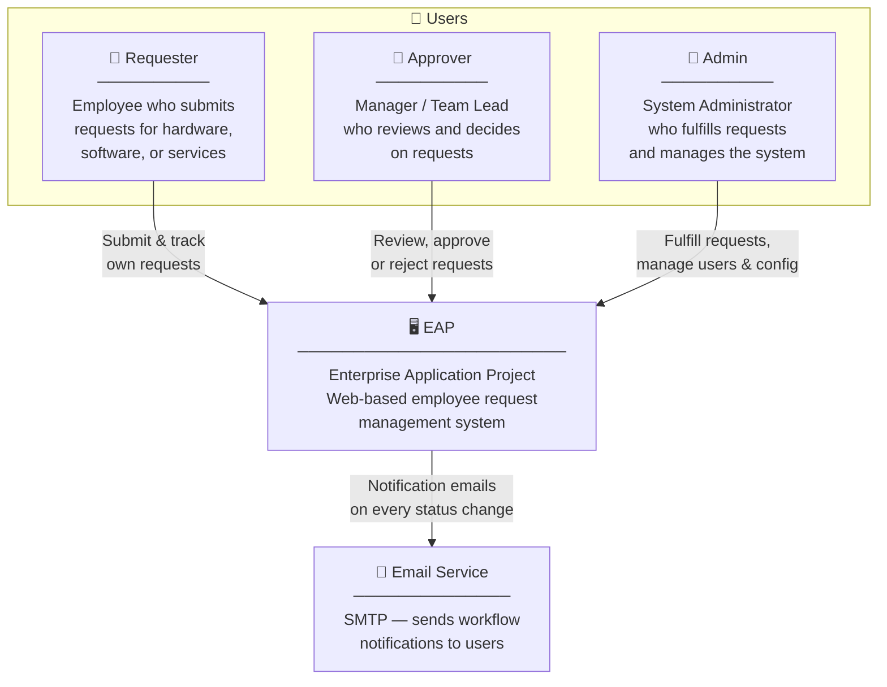

# System Context Diagram

**C4 Level 1** — EAP as a black box, showing who uses it and which external systems it depends on.

## Users

| Actor | Role | Key Actions |
|---|---|---|
| Requester | Employee | Submit, edit, cancel, track own requests |
| Approver | Manager / Team Lead | Review requests, approve or reject with comments |
| Admin | System Administrator | Fulfill approved requests, manage users, configure request types, generate reports |

## External Systems

| System | Purpose |
|---|---|
| Email Service (SMTP) | Notifies users on every workflow event (submission, approval, rejection, completion, cancellation) |