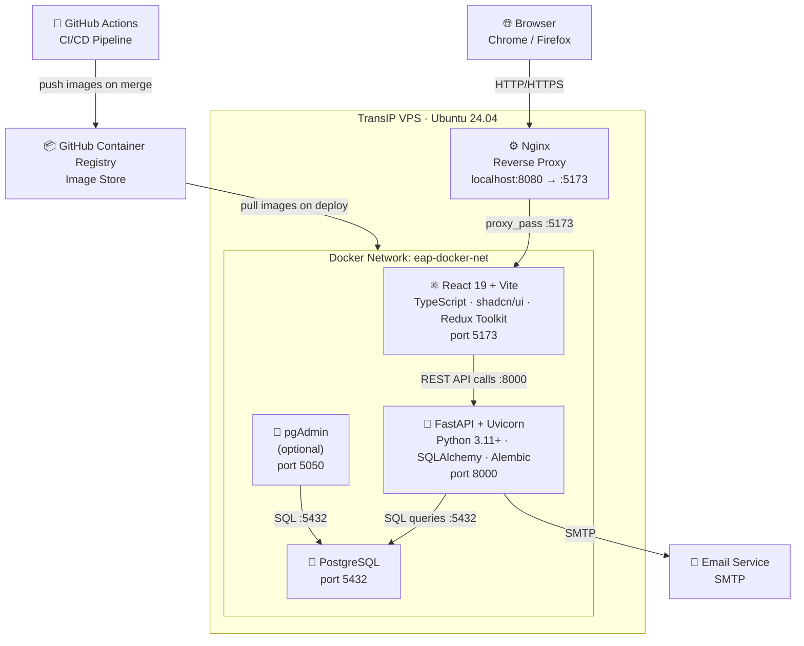

# Container Diagram

**C4 Level 2** — technology choices, ports, and how containers communicate in the local development setup and on the TransIP VPS.

## Communication Summary

| From | To | Protocol | Notes |
|---|---|---|---|
| Browser | Nginx | HTTP / HTTPS | Entry point for all users |
| Nginx | React (Vite) | HTTP proxy | Forwards all requests to port 5173 |
| React | FastAPI | REST / JSON | `VITE_API_URL=http://127.0.0.1:8000` |
| FastAPI | PostgreSQL | SQL | Via Docker network by container name |
| FastAPI | Email Service | SMTP | Triggered on every workflow event |
| pgAdmin | PostgreSQL | SQL | Optional — DB management UI |
| GitHub Actions | GHCR | HTTPS | Pushes images on `dev`/`main` merge |
| GHCR | VPS | HTTPS | VPS pulls latest image on deploy |

## Port Reference

| Service | Internal Port | Host Mapping |
|---|---|---|
| Nginx | 8080 | `localhost:8080` |
| React / Vite | 5173 | `localhost:5173` |
| FastAPI | 8000 | `localhost:8000` |
| PostgreSQL | 5432 | `localhost:5431` (avoids clash with local PG) |
| pgAdmin | 80 | `localhost:5050` |