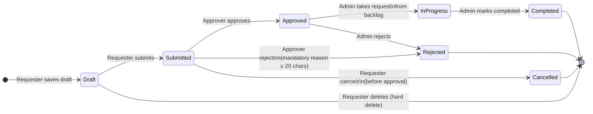

# Request Lifecycle — State Diagram

All possible states a request can be in and the allowed transitions between them.

## State Definitions

| State | Description | Who Can Act |
|---|---|---|
| **Draft** | Created but not yet sent for review | Requester (edit, delete, submit) |
| **Submitted** | Awaiting review — auto-routed to designated Approver | Requester (cancel), Approver (approve / reject) |
| **Approved** | Approved, waiting for Admin to fulfil | Admin (take / reject) |
| **In Progress** | Admin has taken ownership and is fulfilling the request | Admin (complete) |
| **Completed** | Fully fulfilled and closed | — (terminal) |
| **Rejected** | Denied by Approver or Admin | — (terminal) |
| **Cancelled** | Withdrawn by Requester before approval | — (terminal) |

## Transition Rules

| From | To | Actor | Conditions |
|---|---|---|---|
| Draft | Submitted | Requester | All required fields filled |
| Draft | *(deleted)* | Requester | Only in Draft; hard delete |
| Submitted | Approved | Approver | Designated Approver only |
| Submitted | Rejected | Approver | Rejection reason required (≥ 20 chars) |
| Submitted | Cancelled | Requester | Only before Approved |
| Approved | In Progress | Admin | Admin assigns to self from backlog |
| Approved | Rejected | Admin | Admin overrides approval |
| In Progress | Completed | Admin | Fulfilment done |

> Rejected requests cannot be resubmitted — the Requester must create a new request.