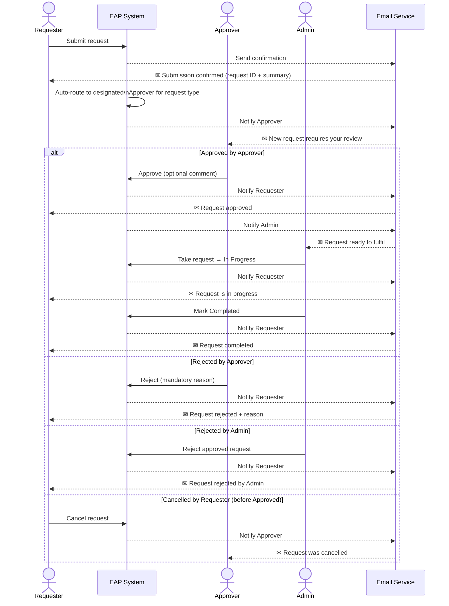

# Approval Workflow — Sequence Diagram

End-to-end flow of a request from submission to completion, including the rejection and cancellation paths.

## Notification Matrix

| Event | Recipient | Email Content |
|---|---|---|
| Request submitted | Requester | Confirmation with request ID and summary |
| Request auto-assigned | Approver | New request requiring review |
| Request approved | Requester | Approval confirmation |
| Request ready to fulfil | Admin | Approved request in backlog |
| Request in progress | Requester | Status update |
| Request completed | Requester | Fulfilment confirmation |
| Request rejected (Approver or Admin) | Requester | Rejection notification with reason |
| Request cancelled | Approver | Cancellation notification |
| Comment added | All relevant parties | New comment notification |

> All emails are sent within 1 minute of the triggering event and include the request ID and a direct link.